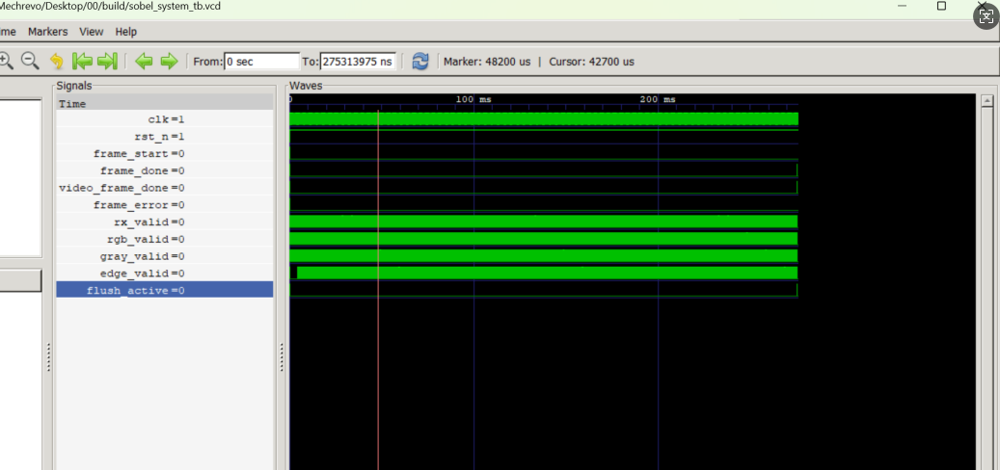

# ZYNQ7020图像处理课程设计 - 仿真报告

基于ZYNQ7020的Sobel图像边缘检测系统实验报告

## 实验一：sobel_00_rtl_sim

## 一、实验目的

1.熟悉FPGA图像处理系统的基本结构。

2.掌握RGB图像灰度化方法。

3.学习Sobel边缘检测算法原理。

4.掌握Verilog RTL级仿真方法。

5.验证图像边缘检测算法的正确性

6.采用RGB转灰度与Sobel卷积算子实现边缘检测，通过FPGA硬件流水线完成图像处理。

## 二、实验环境

软件环境Vivado、Icarus Verilog、GTKWave、Python

## 三、实验原理

3.1 图像处理流程

本实验采用如下图像处理流程：

输入RGB图像UART图像数据流图像接收模块RGB转灰度模块

Sobel边缘检测模块输出边缘图像

4.2 RGB转灰度原理

为了减少运算量，需要先将彩色图像转换为灰度图像。

采用加权平均法：

Gray = 0.299R + 0.587G + 0.114B

其中：

R表示红色分量

G表示绿色分量

B表示蓝色分量

4.3 Sobel边缘检测原理

Sobel算子利用3×3卷积模板计算图像梯度。水平方向卷积核与垂直方向卷积核计算得到Gx与Gy

边缘强度：

Edge = |Gx| + |Gy|

当边缘强度较大时，表示该位置存在明显边缘，转换后每个像素仅保留一个灰度值。

## 四、实验结果分析

4.1 build/input_rgb.png的输入图

4.2.build/sobel_out.png的Sobel输出图

4.3.包含gray_valid、edge_valid的波形截图：

4.4 UART帧格式说明

为了实现图像数据传输，实验采用UART串口通信协议。发送图像前，首先发送固定格式的帧头信息，用于通知FPGA接收端图像的相关参数。帧格式如下：

55 AA WidthL WidthH HeightL HeightH 18

其中：

55 AA：帧同步头，用于标识一帧图像数据的开始；

WidthL、WidthH：图像宽度的低字节和高字节；

HeightL、HeightH：图像高度的低字节和高字节；

18：图像格式标识，表示RGB888格式。

帧头之后依次发送图像像素数据，每个像素由三个字节组成：R G B

其中R、G、B分别表示红、绿、蓝三个颜色分量。FPGA接收到完整帧后，根据图像尺寸信息恢复出原始图像数据，并送入后续图像处理模块。

4.5、Sobel数据流说明

本实验采用流水线结构实现图像边缘检测，数据处理流程如下：

UART输入——图像帧解析——RGB转灰度——行缓存(Line Buffer)——3×3窗口生成——Sobel卷积计算——边缘幅值计算——输出边缘图像

首先，UART接收模块完成串口数据接收，图像帧解析模块提取有效像素数据。由于Sobel算子只需要处理单通道图像，因此首先对RGB图像进行灰度化处理。灰度图像进入行缓存模块，通过缓存连续三行像素数据构建3×3卷积窗口。

随后利用Sobel算子计算得到Gx和Gy后，采用下式计算边缘强度：

Edge = |Gx| + |Gy|

边缘强度越大，表示该位置灰度变化越剧烈，即越有可能属于图像边缘。最终输出的结果为边缘检测后的灰度图像，其中目标轮廓和边界特征被明显增强。

## 五、实验总结

本实验完成了基于Verilog的Sobel边缘检测RTL仿真验证。通过图像输入、灰度化处理以及Sobel卷积运算，实现了图像边缘信息提取。实验结果表明系统能够正确检测图像边界，验证了算法设计与硬件实现的正确性。同时，通过本实验进一步掌握了Verilog模块化设计方法以及FPGA图像处理系统的基本实现流程，为后续HDMI显示实验和实时图像处理实验奠定了基础。
