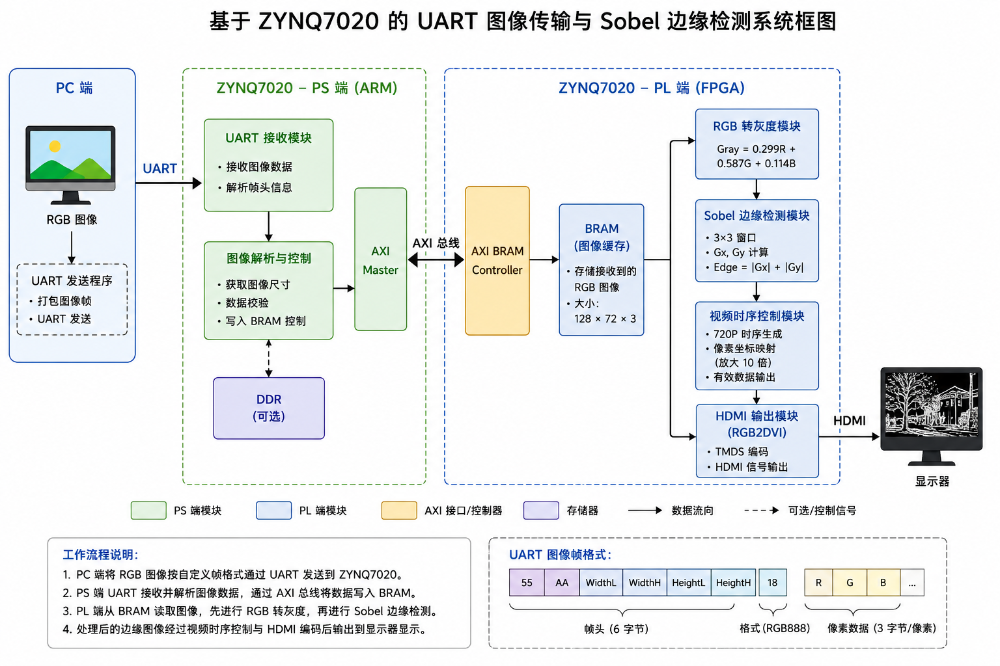

# ZYNQ7020图像处理课程设计 - 初步实验报告

ZYNQ7020图像处理课程设计 - 初步实验报告

## 一、已完成基础实验列表

1. 实验1：sobel_01_hdmi_pattern - HDMI固定图片显示

2. 实验2：sobel_02_hdmi_sobel - 固定图片Sobel边缘检测

3. 实验3：sobel_03_uart_hdmi - UART传图HDMI显示

4. 实验4：sobel_04_uart_sobel_hdmi - UART传图+PL Sobel+HDMI显示

## 二、实验一：sobel_01_hdmi_pattern

### 2.1 实验目标

本实验验证ZYNQ7020开发板的HDMI输出链路。工程把一张128×72 RGB图片存放在Verilog ROM中，并放大10倍显示到1280×720 HDMI画面。

### 2.2 数据流结构

实验数据流如下：

显示关系：

输入图片：128 × 72

HDMI输出：1280 × 720

缩放倍数：10 × 10

### 2.3 关键模块分析

### 2.3.1 hdmi_image_display模块

该模块是实验一的核心显示模块，主要功能包括：

1. HDMI时序生成：产生720p标准显示时序，包括行同步(hs)、场同步(vs)和数据使能(de)信号

2. ROM地址计算：根据当前显示坐标计算ROM读取地址

3. 图像放大显示：将128×72的图像放大10倍显示到1280×720屏幕

关键参数：

核心地址计算逻辑：

通过将显示坐标除以缩放倍数，实现像素的重复显示，从而达到放大效果。

### 2.3.2 image_rom_128x72模块

该模块是一个只读存储器(ROM)，存储了128×72的彩色图像数据。每个像素为24位RGB格式（24'hRRGGBB），共9216个像素（128×72）。

ROM使用Block RAM资源实现，通过(* rom_style = "block" *)综合属性指定。

### 2.4 验收标准完成情况

HDMI显示链路正常工作：显示器能够识别1280×720输入信号，屏幕正常显示图像

行列计数器产生有效显示区域：hdmi_image_display.v中通过h_cnt和v_cnt两个计数器产生行场时序，通过h_active和v_active信号判断有效显示区域

ROM地址计算方式：ROM地址由image_x和image_y计算得出，公式为image_addr = image_y × 128 + image_x，通过位拼接{image_y, 7'b0} + {7'd0, image_x}实现

图像放大原理：图片从128×72放大到1280×720是通过SCALE_X=10和SCALE_Y=10实现的，每个原始像素在水平和垂直方向各重复显示10次

### 2.5 实验现象

HDMI显示器显示图像：

Vivado资源利用率和时序截图：

### 2.6 扩展实验

本实验实现扩展为调整图片显示位置；修改背景颜色；增加简单边框。

- 调整图片显示位置：通过修改image_x和image_y的计算偏移量，可实现图片在屏幕上的位置调整以下为关键实现代码。

- 修改背景颜色：修改非有效图像区域的RGB默认值，可实现不同背景色。需区分图像区域和背景区域的判断条件。

- 增加简单边框：在图像区域边缘增加像素判断条件，当坐标位于边界时输出特定颜色，实现边框效果。

最后得到的实验现象如下，图像往右下偏移，并为其添加了金色边框，背景颜色改为红色。

## 2.7 扩展实现关键代码

修改1：新增图片显示位置控制参数，图片以2倍缩放显示在左上角，偏移50像素

localparam DISPLAY_SCALE = 2;

localparam DISP_WIDTH = IMG_WIDTH * DISPLAY_SCALE;   // 256

localparam DISP_HEIGHT = IMG_HEIGHT * DISPLAY_SCALE; // 144

localparam H_OFFSET = 50;

localparam V_OFFSET = 50;

修改2：新增背景颜色（红色）

localparam BG_R = 8'hFF;

localparam BG_G = 8'h00;

localparam BG_B = 8'h00;

修改3：新增图片有效区域信号

wire img_h_active;

wire img_v_active;

wire img_active;

assign h_active = (h_cnt >= H_START[11:0]) && (h_cnt < (H_START + H_ACTIVE));

assign v_active = (v_cnt >= V_START[11:0]) && (v_cnt < (V_START + V_ACTIVE));

assign video_active = h_active && v_active;

assign hsync_now = (h_cnt >= H_FP[11:0]) && (h_cnt < (H_FP + H_SYNC));

assign vsync_now = (v_cnt >= V_FP[11:0]) && (v_cnt < (V_FP + V_SYNC));

assign active_x = h_cnt - H_START[11:0];

assign active_y = v_cnt - V_START[11:0];

修改4：图片有效区域判断（左上角位置）

assign img_h_active = (active_x >= H_OFFSET) && (active_x < (H_OFFSET + DISP_WIDTH));

assign img_v_active = (active_y >= V_OFFSET) && (active_y < (V_OFFSET + DISP_HEIGHT));

assign img_active = img_h_active && img_v_active;

修改5：ROM地址计算（缩放映射到原始图片）

assign image_x = (active_x - H_OFFSET) / DISPLAY_SCALE;

assign image_y = (active_y - V_OFFSET) / DISPLAY_SCALE;

assign image_addr = {image_y, 7'b0} + {7'd0, image_x};

assign hs = hs_reg_d0;

assign vs = vs_reg_d0;

assign de = de_reg_d0;

## 三、sobel_02_hdmi_sobel

### 3.1 实验目标

本实验在sobel_01_hdmi_pattern的HDMI固定图片显示基础上，加入灰度转换和Sobel边缘检测。输入仍然来自128×72固定图片ROM，PL端完成图像处理后把边缘结果放大显示到1280×720 HDMI画面。

### 3.2 数据流结构

实验数据流：image_rom_128x72 (RGB888) → rgb_to_gray (灰度转换) → sobel_core (Sobel边缘强度) → edge_mem (一帧边缘缓存) → hdmi_sobel_display (放大显示) → rgb2dvi_0 → HDMI显示器

显示关系：输入128×72 RGB888，Sobel输出128×72 8bit edge，HDMI输出1280×720，缩放10×10

### 3.3 关键模块分析

### 3.3.1 rgb_to_gray模块

该模块实现RGB888到灰度的转换，使用整数运算近似标准灰度公式。

输入输出信号：

核心算法：使用整数系数近似标准灰度公式Gray = 0.299R + 0.587G + 0.114B

通过乘以整数系数后右移8位（除以256）来近似浮点运算，避免浮点运算的资源开销。

### 3.3.2 sobel_core模块

该模块实现Sobel边缘检测算法，通过3×3邻域卷积计算边缘强度。输入输出信号如下：

核心实现原理：

- 行缓存机制：使用两个行缓存存储前两行像素数据，配合当前输入像素形成3×3卷积窗口

- 3×3窗口生成：通过移位寄存器方式维护9个像素的卷积窗口

- Sobel卷积计算：Gx检测垂直边缘，Gy检测水平边缘，边缘强度为|Gx|+|Gy|

- 边界处理：图像边界像素直接输出0（黑色）

- flush机制：处理完最后一行后补充输出边界像素，保证输出尺寸与输入一致

### 3.3.3 hdmi_sobel_display模块

该模块是实验二的顶层显示模块，集成了图像ROM读取、灰度转换、Sobel运算和HDMI显示功能。

状态机设计：

edge_mem的作用：使用Block RAM实现的edge_mem用于缓存一帧Sobel边缘检测结果（9216字节）。原因：Sobel运算有流水线延迟，HDMI显示需要按扫描顺序读取，通过帧缓存避免画面撕裂。

### 3.4 验收标准完成情况

1. rgb_to_gray的输入输出信号：输入为rgb_valid、r[7:0]、g[7:0]、b[7:0]、x[15:0]、y[15:0]；输出为gray_valid、gray[7:0]、gray_x[15:0]、gray_y[15:0]。模块为单周期延迟。

sobel_core的输入输出信号：输入为frame_start、gray_valid、gray[7:0]、gray_x[15:0]、gray_y[15:0]；输出为edge_valid、edge_data[7:0]、edge_x[15:0]、edge_y[15:0]、edge_frame_done。模块包含多行缓存延迟。

edge_mem的写入和读取时机：写入时机为edge_valid有效时，将edge_data写入对应地址；读取时机为HDMI显示期间，根据显示坐标从edge_mem中读取边缘像素值。

Sobel输出映射为HDMI的RGB通道：Sobel输出的8位边缘强度值同时赋值给R、G、B三个通道，因此显示为黑白灰度边缘图。

### 3.5 实验现象

### 3.5.1实验结果:

Sobel边缘检测效果验证了灰度转换模块和Sobel核心模块的正确性。边缘的清晰度和完整性取决于输入图片的对比度和Sobel算法的阈值设置。黑白灰度显示方式直观展示了边缘强度的分布情况。

### 3.5.2资源利用率和时序截图

### 3.6 扩展实验

### 3.6.1 边缘反色显示

将边缘数据取反后输出，原黑底白边变成白底黑边。

### 3.6.3彩色边缘标记及Sobel阈值参数对比

对图像边缘像素使用红色突出显示，非边缘区域保持黑色或灰度，增强边缘的视觉辨识度；然后修改二值化阈值，对比不同阈值下边缘检测效果，阈值越低检测到的边缘越多但噪声也越多。

下面所示图片从上往下分别为在为图像添加红色边缘标记之后，且阈值在80，180，20下的HDMI显示效果。

## 四、实验三：sobel_03_uart_hdmi

### 4.1 实验目标

本实验验证UART→PS→AXI BRAM→PL HDMI的完整显示链路。PC端通过串口发送图像，ZYNQ PS端接收图像并写入AXI BRAM，PL端从BRAM读取图像并通过HDMI输出到显示器。

### 4.2 数据流结构

实验数据流：PC摄像头/图片 → USB串口(115200 baud) → ZYNQ PS UART → PS软件解析帧数据 → AXI GP0 → AXI BRAM Controller → Block RAM (0x00RRGGBB) → PL HDMI读BRAM → RGB2DVI → HDMI显示器

关键参数：

BRAM地址映射：

- PS写入格式：

address = 0x40000000 + ((y × 128 + x) << 2)

data = 0x00RRGGBB（32位字，低24位为RGB888）

- 串口协议：

帧头：0x55 0xAA width_l width_h height_l height_h format

行头：每行前有0x33 0xCC row_l row_h

像素数据：每行128个RGB888像素，每像素3字节R G B

### 4.3 关键模块分析

### 4.3.1 hdmi_bram_display模块

该模块是PL端的HDMI显示模块，从AXI BRAM中读取图像数据并通过HDMI输出。

- BRAM接口信号：

- 地址计算：

每个像素占4字节（32位字），因此字地址需要左移2位转换为字节地址。

- 时序对齐：

使用两级寄存器打拍（hs_reg_d0/d1, vs_reg_d0/d1, de_reg_d0/d1）补偿BRAM读取延迟，保证同步信号和像素数据对齐输出。

### 4.3.2 PS端软件

PS端软件的主要功能：

- 初始化UART串口，波特率115200

- 初始化AXI BRAM控制器

- 等待PC端发送图像帧头

- 解析帧头，获取图像尺寸和格式

- 逐行接收像素数据，写入BRAM对应地址

- 接收完成后等待下一帧

### 4.4 实验现象与结果分析

### 4.4.1 HDMI显示图像

### 4.4.2 上位机串口信息

### 4.4.3 资源利用率和时序结果

### 4.6 扩展实验

本实验实现扩展为调整图片显示位置；修改HDMI背景颜色；增加图像边框。

- 调整图片显示位置：通过修改image_x和image_y的计算偏移量，可实现图片在屏幕上的位置调整。

- 修改背景颜色：修改非图像区域的RGB默认值，可实现不同背景色。串口图像仍正常显示，背景颜色按设计变化。

- 增加简单边框：在图像区域边缘增加像素判断条件，当坐标位于边界时输出特定颜色，实现边框效果。

最后得到的实验现象如下， 图像往右下偏移并添加了黄色边框，背景颜色改为深蓝色。

## 五、实验四：sobel_04_uart_sobel_hdmi

### 5.1 实验目标

本实验在sobel_03基础上完成Sobel边缘检测显示。数据由PC端通过串口发送到ZYNQ7020，PS端负责接收128×72 RGB888图像并写入AXI BRAM，PL端从BRAM读取原始图像，完成灰度转换和Sobel运算，最后把边缘检测结果通过HDMI显示。

### 5.2 数据流结构及系统框图

实验数据流：PC摄像头/图片 → UART(115200) → ZYNQ PS UART → PS写入AXI BRAM(原始RGB图像) → AXI BRAM(0x00RRGGBB) → PL读取BRAM原图 → PL rgb_to_gray → PL sobel_core → PL edge_mem → HDMI显示(Sobel边缘图)

1. 与sobel_03的区别：

- sobel_03：显示串口收到的原始RGB图像

- sobel_04：显示PL Sobel运算后的灰度边缘图

2. PS程序功能：

- 初始化PS UART，波特率115200

- 先向BRAM写入一张128×72彩色测试图

- 循环等待PC端发送RGB888图像

- 接收后把原始RGB图像写入BRAM

- Sobel运算由PL自动读取BRAM并完成

## 5.3 关键模块分析

### 5.3.1 hdmi_bram_sobel_display模块

该模块是实验四的核心显示模块，集成了BRAM图像读取、灰度转换、Sobel运算、边缘缓存和HDMI显示功能。

扫描状态机：

核心架构：

例化rgb_to_gray模块进行灰度转换

例化sobel_core模块进行Sobel边缘检测

edge_mem：9216×8的block RAM，缓存一帧边缘结果

BRAM只读接口，读取原始RGB图像

每帧开始时（video_frame_start）触发一次完整扫描和Sobel处理

sobel_done标志置1后，HDMI显示边缘结果

与hdmi_sobel_display的区别：

### 5.3.2 扫描与显示的时序关系

本模块采用"扫描-处理-显示"的工作模式：

每帧HDMI开始时，启动BRAM图像扫描

扫描过程中逐像素送入灰度转换和Sobel流水线

Sobel处理完成后，边缘结果存入edge_mem

HDMI显示从edge_mem中读取上一帧的处理结果

下一帧开始时重复上述过程

这种模式保证了显示的稳定性，避免了Sobel处理延迟导致的画面撕裂。

### 5.4 实验现象与结果分析

### 5.4.1 HDMI显示图像

### 5.4.2 资源利用率和时序结果

### 5.5 扩展实验分析

5.5.1 固定阈值二值化边缘显示

在Sobel输出到RGB映射前增加阈值判断，实现黑白二值边缘图。

5.5.2 边缘反色显示

将边缘数据取反后输出，原黑底白边变成白底黑边。

5.5.3彩色边缘标记及Sobel阈值参数对比

对图像边缘像素使用红色突出显示，非边缘区域保持黑色或灰度，增强边缘的视觉辨识度；然后修改二值化阈值，对比不同阈值下边缘检测效果，阈值越低检测到的边缘越多但噪声也越多。

下面所示图片从上往下分别为在为图像添加红色边缘标记之后，且阈值在50，100，40下的HDMI显示效果。

5.5.4彩色边缘标记及Sobel阈值参数对比

## 6.1扩展实现关键代码

修改1：参数配置区域（第27-38行）

// ========== 扩展参数配置 ==========

显示模式选择：0=二值化边缘，1=反色边缘，2=彩色边缘，3=原始灰度

parameter DISPLAY_MODE = 0;  // 修改此值切换模式（0-3）

// Sobel阈值参数（用于二值化）

parameter SOBEL_THRESHOLD = 50;  // 默认阈值50，可调范围0-255

// 彩色边缘标记颜色（RGB各8位）

parameter EDGE_COLOR_R = 8'hFF;  // 红色分量

parameter EDGE_COLOR_G = 8'h00;  // 绿色分量

parameter EDGE_COLOR_B = 8'h00;  // 蓝色分量 (红色边缘)

修改2：新增扩展信号定义，新增二值化、反色、彩色标记等中间信号和模式选择输出信号

wire [7:0] edge_thresholded;  // 二值化后的边缘

wire [7:0] edge_inverted;     // 反色边缘

wire [7:0] edge_colored;      // 彩色边缘标记

wire de_active;               // 有效显示使能

// 模式选择输出信号

reg [7:0] selected_r;

reg [7:0] selected_g;

reg [7:0] selected_b;

修改3：实现二值化、反色、彩色标记三种处理逻辑

// 1. 固定阈值二值化

assign edge_thresholded = (edge_pixel >= SOBEL_THRESHOLD) ? 8'hFF : 8'h00;

// 2. 边缘反色

assign edge_inverted = ~edge_thresholded;

// 3. 彩色边缘标记（保留原始边缘幅值用于彩色显示）

assign edge_colored = (edge_pixel >= SOBEL_THRESHOLD) ? edge_pixel : 8'h00;

修改4：新增case语句实现四种显示模式切换，替代原有的简单RGB赋值

// ========== 模式选择逻辑 ==========

assign de_active = de_reg_d0 && sobel_done;

always @(*) begin

// 默认值（黑色背景）

selected_r = 8'h00;

selected_g = 8'h00;

selected_b = 8'h00;

if (de_active) begin

case (DISPLAY_MODE)

0: begin  // 二值化模式 - 黑底白边

selected_r = edge_thresholded;

selected_g = edge_thresholded;

selected_b = edge_thresholded;

1: begin  // 反色模式 - 白底黑边

selected_r = edge_inverted;

selected_g = edge_inverted;

selected_b = edge_inverted;

end

2: begin  // 彩色边缘模式 - 边缘用指定颜色突出显示

if (edge_colored != 8'h00) begin

selected_r = EDGE_COLOR_R;

selected_g = EDGE_COLOR_G;

selected_b = EDGE_COLOR_B;

end else begin

selected_r = 8'h00;

selected_g = 8'h00;

selected_b = 8'h00;

end

end

default: begin  // 原始灰度模式（模式3）

selected_r = edge_pixel;

selected_g = edge_pixel;

selected_b = edge_pixel;

end

endcase

end

end

// ========== RGB输出 ==========

assign rgb_r = selected_r;

assign rgb_g = selected_g;

assign rgb_b = selected_b;

## 六、系统总体框图和数据流说明

### 6.1 总体架构

ZYNQ7020图像处理系统采用PS+PL的异构架构：

PS端：负责UART通信、图像数据接收、BRAM写入控制

PL端：负责图像读取、灰度转换、Sobel边缘检测、HDMI显示输出

AXI BRAM：作为PS与PL之间的数据共享缓冲区

### 6.2 完整数据流

从PC端图像输入到HDMI显示输出的完整数据流：

PC端采集摄像头图像或读取图片文件

PC端通过USB串口以115200波特率发送图像数据

ZYNQ PS端UART接收图像数据

PS软件解析帧头和像素数据

PS通过AXI GP0接口将图像写入AXI BRAM

PL端从BRAM读取原始RGB图像

PL端rgb_to_gray模块进行灰度转换

PL端sobel_core模块进行Sobel边缘检测

边缘结果存入edge_mem帧缓存

HDMI显示模块从edge_mem读取边缘数据

RGB2DVI IP核进行TMDS编码

HDMI显示器显示最终边缘检测结果

### 6.3 关键技术点

## 七、当前未解决的问题

串口传输帧率低：受115200波特率限制，图像传输帧率不到0.5fps，实时性较差。后续可考虑使用更高带宽的接口（如以太网、USB）。

Sobel边缘检测噪声：当前Sobel算法直接输出边缘强度，未进行阈值处理和噪声抑制，图像中可能存在较多噪声边缘。

图像分辨率受限：当前使用128×72的低分辨率图像，主要受限于串口带宽和BRAM容量。

无上位机控制界面：当前只能通过命令行参数控制，缺乏直观的图形化控制界面。

## 八、第二周综合扩展计划

### 8.1 计划选择的综合扩展题目

计划选择综合扩展任务3：增加图像处理算法，在现有基础上增加新的PL图像处理算法，并通过命令选择显示结果。
### 8.2 具体计划

1. 算法选择：新增Prewitt边缘检测算法，与原Sobel算法形成对比
2. 软件验证：使用Python或MATLAB生成Prewitt算法的参考结果，作为golden model
3. RTL设计：编写Prewitt算法的Verilog实现，包括3×3窗口生成和卷积计算
4. 仿真验证：编写Testbench，对比RTL输出与软件参考结果，确保功能正确
5. 系统集成：将Prewitt模块集成到显示系统中，增加显示模式切换控制
6. 上板验证：综合实现后下载到开发板，验证上板效果
7. 性能分析：对比Sobel和Prewitt的资源利用率、时序和视觉效果

### 8.3 仿真计划

- 输入测试图像：使用与实验05相同的128×72测试图片
- 验证内容：行场同步时序、ROM地址、像素数据正确性
- 关键观察信号：h_cnt、v_cnt、video_active、image_addr、rgb_r/g/b
