# ZYNQ7020图像处理课程设计 - 初步实验报告

ZYNQ7020图像处理课程设计 - 初步实验报告

# 一、已完成基础实验列表

1. 实验1：sobel_01_hdmi_pattern - HDMI固定图片显示

2. 实验2：sobel_02_hdmi_sobel - 固定图片Sobel边缘检测

3. 实验3：sobel_03_uart_hdmi - UART传图HDMI显示

4. 实验4：sobel_04_uart_sobel_hdmi - UART传图+PL Sobel+HDMI显示

# 二、实验一：sobel_01_hdmi_pattern

## 2.1 实验目标

本实验验证ZYNQ7020开发板的HDMI输出链路。工程把一张128×72 RGB图片存放在Verilog ROM中，并放大10倍显示到1280×720 HDMI画面。

## 2.2 数据流结构

实验数据流如下：

显示关系：

输入图片：128 × 72

HDMI输出：1280 × 720

缩放倍数：10 × 10

## 2.3 关键模块分析

### 2.3.1 hdmi_image_display模块

该模块是实验一的核心显示模块，主要功能包括：

1. HDMI时序生成：产生720p标准显示时序，包括行同步(hs)、场同步(vs)和数据使能(de)信号

2. ROM地址计算：根据当前显示坐标计算ROM读取地址

3. 图像放大显示：将128×72的图像放大10倍显示到1280×720屏幕

关键参数：

核心地址计算逻辑：

通过将显示坐标除以缩放倍数，实现像素的重复显示，从而达到放大效果。

### 2.3.2 image_rom_128x72模块

该模块是一个只读存储器(ROM)，存储了128×72的彩色图像数据。每个像素为24位RGB格式（24'hRRGGBB），共9216个像素（128×72）。

ROM使用Block RAM资源实现，通过(* rom_style = "block" *)综合属性指定。

## 2.4 验收标准完成情况

HDMI显示链路正常工作：显示器能够识别1280×720输入信号，屏幕正常显示图像

行列计数器产生有效显示区域：hdmi_image_display.v中通过h_cnt和v_cnt两个计数器产生行场时序，通过h_active和v_active信号判断有效显示区域

ROM地址计算方式：ROM地址由image_x和image_y计算得出，公式为image_addr = image_y × 128 + image_x，通过位拼接{image_y, 7'b0} + {7'd0, image_x}实现

图像放大原理：图片从128×72放大到1280×720是通过SCALE_X=10和SCALE_Y=10实现的，每个原始像素在水平和垂直方向各重复显示10次

## 2.5 实验现象

HDMI显示器显示图像：


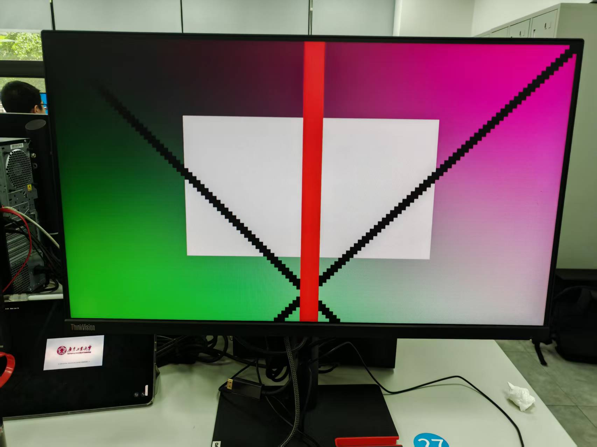


Vivado资源利用率和时序截图：


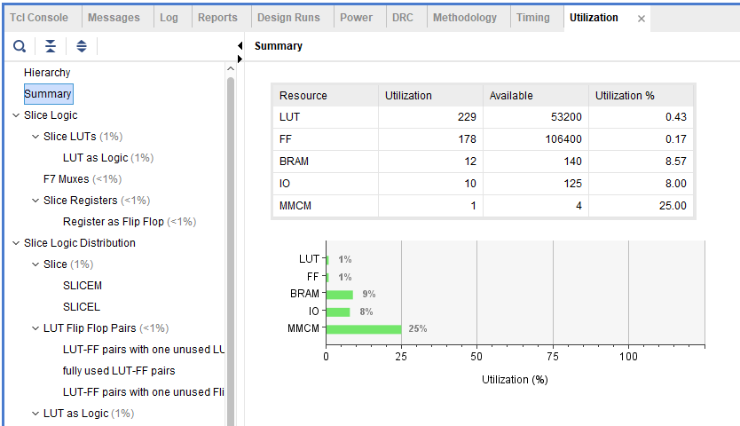


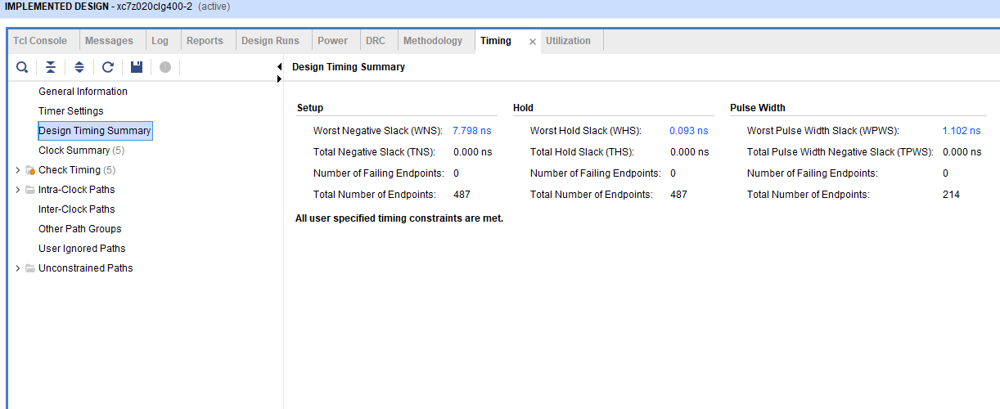


## 2.6 扩展实验

本实验实现扩展为调整图片显示位置；修改背景颜色；增加简单边框。

- 调整图片显示位置：通过修改image_x和image_y的计算偏移量，可实现图片在屏幕上的位置调整以下为关键实现代码。

- 修改背景颜色：修改非有效图像区域的RGB默认值，可实现不同背景色。需区分图像区域和背景区域的判断条件。

- 增加简单边框：在图像区域边缘增加像素判断条件，当坐标位于边界时输出特定颜色，实现边框效果。

最后得到的实验现象如下，图像往右下偏移，并为其添加了金色边框，背景颜色改为红色。


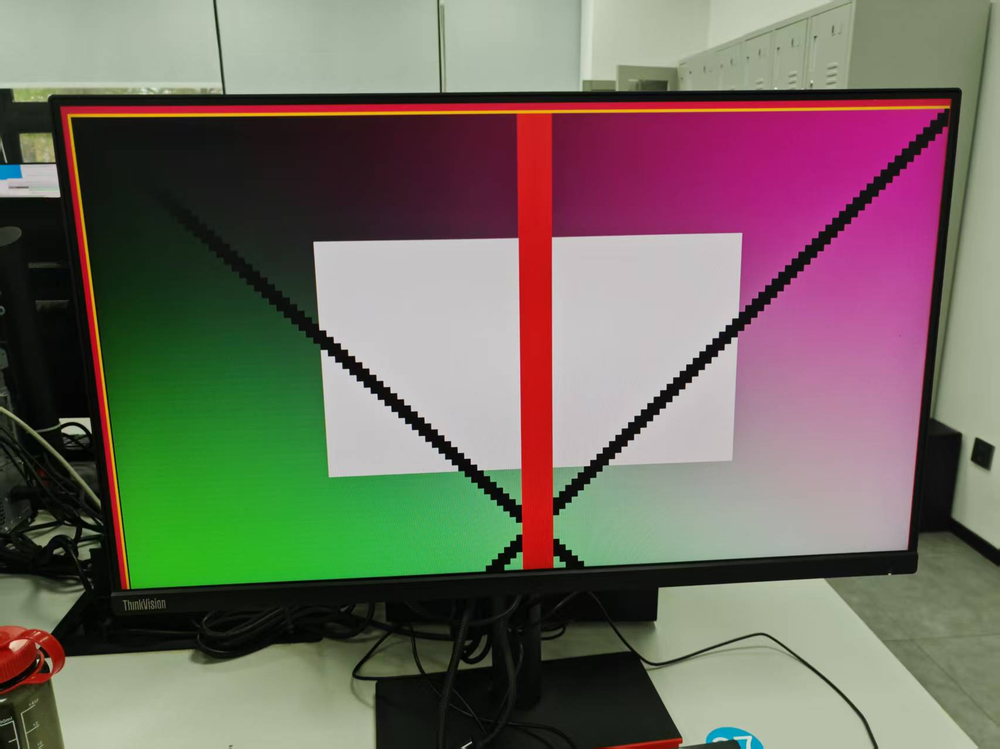


## 2.7 扩展实现关键代码

### 2.7.1 图像偏移

```verilog
// ===== 在参数定义区域添加 =====
// 图片缩放倍数（原始128x72，显示为256x144）
localparam DISPLAY_SCALE = 2;
localparam DISP_WIDTH = IMG_WIDTH * DISPLAY_SCALE;   // 256
localparam DISP_HEIGHT = IMG_HEIGHT * DISPLAY_SCALE; // 144
// 左上角偏移（像素）
localparam H_OFFSET = 50;
localparam V_OFFSET = 50;

// ===== 修改坐标映射逻辑 =====
// 原来：全屏缩放
// assign image_x = active_x / SCALE_X;
// assign image_y = active_y / SCALE_Y;

// 修改后：带偏移的缩放映射
wire img_h_active, img_v_active, img_active;
assign img_h_active = (active_x >= H_OFFSET) && (active_x < (H_OFFSET + DISP_WIDTH));
assign img_v_active = (active_y >= V_OFFSET) && (active_y < (V_OFFSET + DISP_HEIGHT));
assign img_active = img_h_active && img_v_active;

assign image_x = (active_x - H_OFFSET) / DISPLAY_SCALE;
assign image_y = (active_y - V_OFFSET) / DISPLAY_SCALE;
assign image_addr = {image_y, 7'b0} + {7'd0, image_x};

// ROM地址只在图片有效区域更新
// rom_addr <= img_active ? image_addr : 14'd0;
```

### 2.7.2 背景颜色更改

```verilog
// ===== 在参数定义区域添加 =====
// 背景颜色（红色）
localparam BG_R = 8'hFF;
localparam BG_G = 8'h00;
localparam BG_B = 8'h00;

// ===== 修改RGB输出逻辑 =====
// 原来：非图片区域输出黑色
// assign rgb_r = de_reg_d0 ? image_pixel[23:16] : 8'h00;

// 修改后：非图片区域输出红色背景
wire [7:0] out_r, out_g, out_b;
assign out_r = img_active ? image_pixel[23:16] : BG_R;
assign out_g = img_active ? image_pixel[15:8]  : BG_G;
assign out_b = img_active ? image_pixel[7:0]   : BG_B;
assign rgb_r = de_reg_d0 ? out_r : 8'h00;
assign rgb_g = de_reg_d0 ? out_g : 8'h00;
assign rgb_b = de_reg_d0 ? out_b : 8'h00;
```

### 2.7.3 添加金色边框

```verilog
// ===== 在参数定义区域添加 =====
localparam BORDER_WIDTH = 4;  // 边框宽度（像素）
// 边框颜色（金色）
localparam BORDER_R = 8'hFF;
localparam BORDER_G = 8'hD7;
localparam BORDER_B = 8'h00;

// ===== 在坐标映射区域添加边框判断 =====
wire border_h_left, border_h_right, border_v_top, border_v_bottom;
wire border_active;

// 边框判断：在图片有效区域的边缘
assign border_h_left   = (active_x >= H_OFFSET) && (active_x < (H_OFFSET + BORDER_WIDTH));
assign border_h_right  = (active_x >= (H_OFFSET + DISP_WIDTH - BORDER_WIDTH)) && 
                         (active_x < (H_OFFSET + DISP_WIDTH));
assign border_v_top    = (active_y >= V_OFFSET) && (active_y < (V_OFFSET + BORDER_WIDTH));
assign border_v_bottom = (active_y >= (V_OFFSET + DISP_HEIGHT - BORDER_WIDTH)) && 
                         (active_y < (V_OFFSET + DISP_HEIGHT));
assign border_active = img_active && (border_h_left || border_h_right || border_v_top || border_v_bottom);

// ===== 修改RGB输出逻辑（优先级：边框 > 图片 > 背景） =====
assign out_r = border_active ? BORDER_R :
               (img_active && !border_active) ? image_pixel[23:16] : BG_R;
assign out_g = border_active ? BORDER_G :
               (img_active && !border_active) ? image_pixel[15:8]  : BG_G;
assign out_b = border_active ? BORDER_B :
               (img_active && !border_active) ? image_pixel[7:0]   : BG_B;

// ===== 修改ROM访问：边框区域不访问ROM =====
// rom_addr <= (img_active && !border_active) ? image_addr : 14'd0;
```

# 三、sobel_02_hdmi_sobel

## 3.1 实验目标

本实验在sobel_01_hdmi_pattern的HDMI固定图片显示基础上，加入灰度转换和Sobel边缘检测。输入仍然来自128×72固定图片ROM，PL端完成图像处理后把边缘结果放大显示到1280×720 HDMI画面。

## 3.2 数据流结构

实验数据流：image_rom_128x72 (RGB888) → rgb_to_gray (灰度转换) → sobel_core (Sobel边缘强度) → edge_mem (一帧边缘缓存) → hdmi_sobel_display (放大显示) → rgb2dvi_0 → HDMI显示器

显示关系：输入128×72 RGB888，Sobel输出128×72 8bit edge，HDMI输出1280×720，缩放10×10

## 3.3 关键模块分析

### 3.3.1 rgb_to_gray模块

该模块实现RGB888到灰度的转换，使用整数运算近似标准灰度公式。

输入输出信号：

核心算法：使用整数系数近似标准灰度公式Gray = 0.299R + 0.587G + 0.114B

通过乘以整数系数后右移8位（除以256）来近似浮点运算，避免浮点运算的资源开销。

### 3.3.2 sobel_core模块

该模块实现Sobel边缘检测算法，通过3×3邻域卷积计算边缘强度。输入输出信号如下：

核心实现原理：

- 行缓存机制：使用两个行缓存存储前两行像素数据，配合当前输入像素形成3×3卷积窗口

- 3×3窗口生成：通过移位寄存器方式维护9个像素的卷积窗口

- Sobel卷积计算：Gx检测垂直边缘，Gy检测水平边缘，边缘强度为|Gx|+|Gy|

- 边界处理：图像边界像素直接输出0（黑色）

- flush机制：处理完最后一行后补充输出边界像素，保证输出尺寸与输入一致

### 3.3.3 hdmi_sobel_display模块

该模块是实验二的顶层显示模块，集成了图像ROM读取、灰度转换、Sobel运算和HDMI显示功能。

状态机设计：

edge_mem的作用：使用Block RAM实现的edge_mem用于缓存一帧Sobel边缘检测结果（9216字节）。原因：Sobel运算有流水线延迟，HDMI显示需要按扫描顺序读取，通过帧缓存避免画面撕裂。

## 3.4 验收标准完成情况

1. rgb_to_gray的输入输出信号：输入为rgb_valid、r[7:0]、g[7:0]、b[7:0]、x[15:0]、y[15:0]；输出为gray_valid、gray[7:0]、gray_x[15:0]、gray_y[15:0]。模块为单周期延迟。

sobel_core的输入输出信号：输入为frame_start、gray_valid、gray[7:0]、gray_x[15:0]、gray_y[15:0]；输出为edge_valid、edge_data[7:0]、edge_x[15:0]、edge_y[15:0]、edge_frame_done。模块包含多行缓存延迟。

edge_mem的写入和读取时机：写入时机为edge_valid有效时，将edge_data写入对应地址；读取时机为HDMI显示期间，根据显示坐标从edge_mem中读取边缘像素值。

Sobel输出映射为HDMI的RGB通道：Sobel输出的8位边缘强度值同时赋值给R、G、B三个通道，因此显示为黑白灰度边缘图。

## 3.5 实验现象

### 3.5.1实验结果:


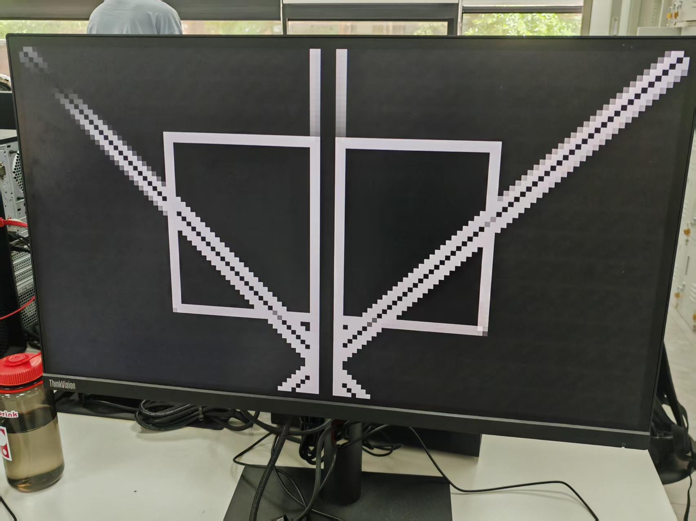


Sobel边缘检测效果验证了灰度转换模块和Sobel核心模块的正确性。边缘的清晰度和完整性取决于输入图片的对比度和Sobel算法的阈值设置。黑白灰度显示方式直观展示了边缘强度的分布情况。

### 3.5.2资源利用率和时序截图


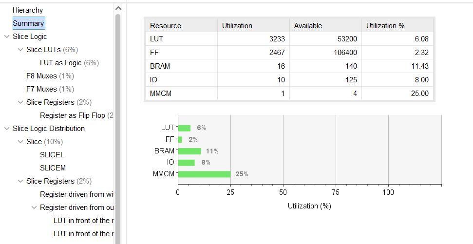


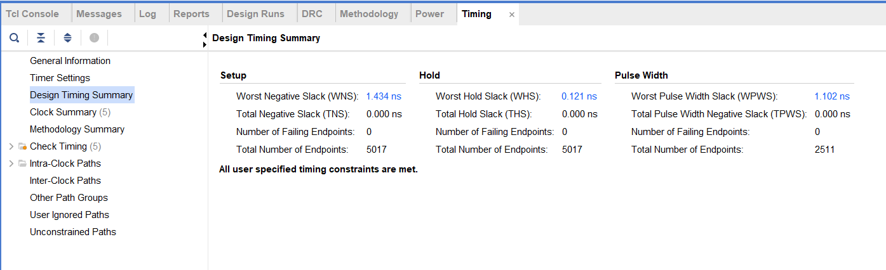


## 3.6 扩展实验

### 3.6.1 边缘反色显示

将边缘数据取反后输出，原黑底白边变成白底黑边。


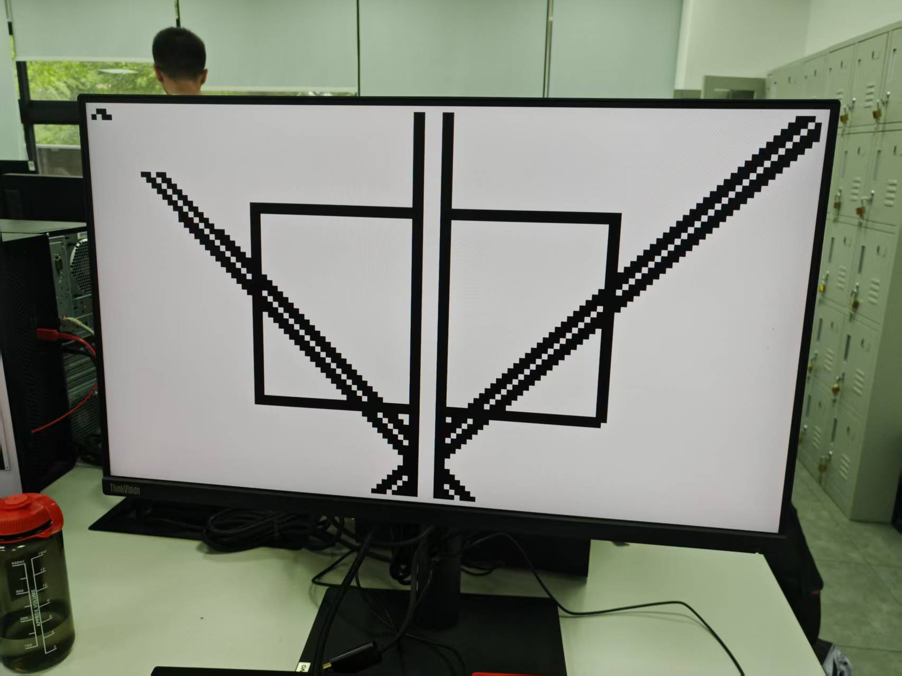


### 3.6.3彩色边缘标记及Sobel阈值参数对比

对图像边缘像素使用红色突出显示，非边缘区域保持黑色或灰度，增强边缘的视觉辨识度；然后修改二值化阈值，对比不同阈值下边缘检测效果，阈值越低检测到的边缘越多但噪声也越多。

下面所示图片从上往下分别为在为图像添加红色边缘标记之后，且阈值在80，180，20下的HDMI显示效果。


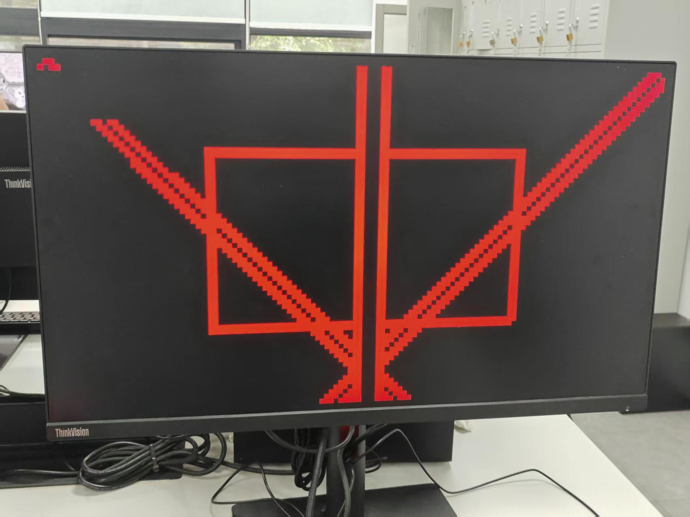


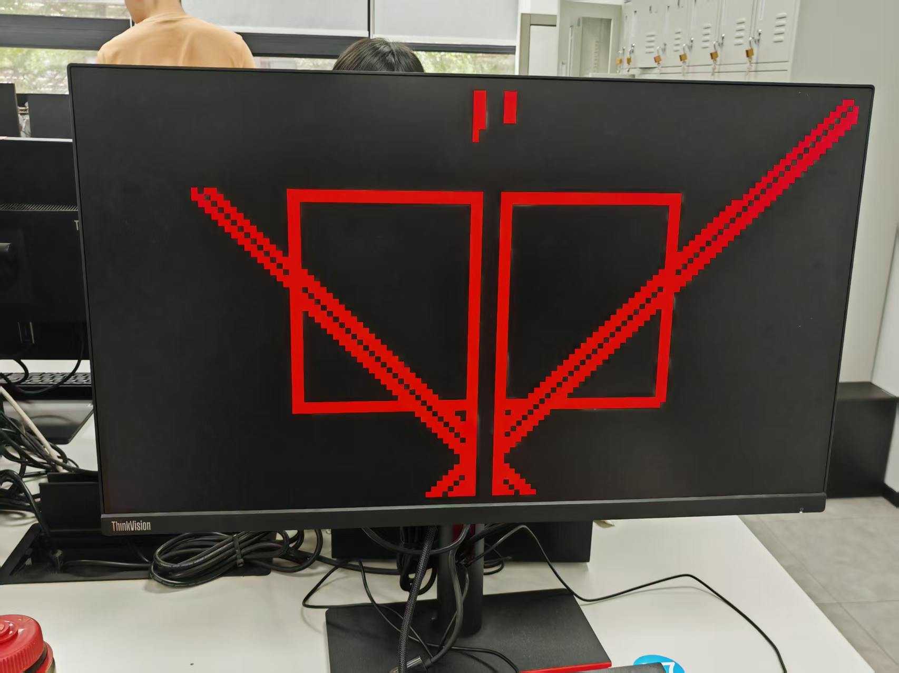


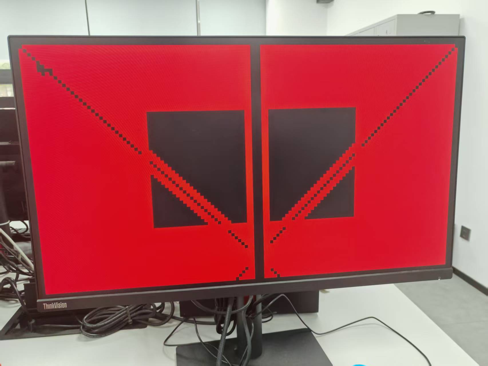

## 3.7 扩展实现关键代码

### 3.7.1 边缘反色显示

```verilog
// ========== 参数定义 ==========
parameter DISPLAY_MODE = 2'd1;  // 设置为1启用反色模式

// ========== 二值化处理 ==========
wire [7:0] edge_binary;
assign edge_binary = (edge_pixel >= EDGE_THRESHOLD) ? 8'hFF : 8'h00;

// ========== 反色输出 ==========
wire [7:0] inv_r, inv_g, inv_b;
assign inv_r = ~edge_binary;
assign inv_g = ~edge_binary;
assign inv_b = ~edge_binary;

// ========== 模式选择 ==========
reg [7:0] display_r, display_g, display_b;
always @(*) begin
    case (DISPLAY_MODE)
        2'd1: begin   // 反色模式
            display_r = inv_r;
            display_g = inv_g;
            display_b = inv_b;
        end
        // ... 其他模式
    endcase
end

// ========== HDMI输出 ==========
assign rgb_r = (de_reg_d0 && sobel_done) ? display_r : 8'h00;
assign rgb_g = (de_reg_d0 && sobel_done) ? display_g : 8'h00;
assign rgb_b = (de_reg_d0 && sobel_done) ? display_b : 8'h00;
```

### 3.7.2 红色边缘标记

```verilog
// ========== 参数定义 ==========
parameter DISPLAY_MODE = 2'd2;          // 2=红色，3=绿色，4=蓝色
parameter EDGE_COLOR_R = 8'hFF;         // 可自定义颜色亮度
parameter EDGE_COLOR_G = 8'h00;
parameter EDGE_COLOR_B = 8'h00;

// ========== 二值化处理（同上） ==========
wire [7:0] edge_binary;
assign edge_binary = (edge_pixel >= EDGE_THRESHOLD) ? 8'hFF : 8'h00;

// ========== 彩色边缘映射（条件表达式） ==========
// 红色边缘：边缘显示红色，非边缘黑色
wire [7:0] red_r, red_g, red_b;
assign red_r = edge_binary ? EDGE_COLOR_R : 8'h00;
assign red_g = 8'h00;
assign red_b = 8'h00;

// 绿色边缘
wire [7:0] green_r, green_g, green_b;
assign green_r = 8'h00;
assign green_g = edge_binary ? EDGE_COLOR_G : 8'h00;
assign green_b = 8'h00;

// 蓝色边缘
wire [7:0] blue_r, blue_g, blue_b;
assign blue_r = 8'h00;
assign blue_g = 8'h00;
assign blue_b = edge_binary ? EDGE_COLOR_B : 8'h00;

// ========== 模式选择 ==========
reg [7:0] display_r, display_g, display_b;
always @(*) begin
    case (DISPLAY_MODE)
        2'd2: begin   // 红色边缘
            display_r = red_r;
            display_g = red_g;
            display_b = red_b;
        end
        2'd3: begin   // 绿色边缘
            display_r = green_r;
            display_g = green_g;
            display_b = green_b;
        end
        2'd4: begin   // 蓝色边缘
            display_r = blue_r;
            display_g = blue_g;
            display_b = blue_b;
        end
        // ... 其他模式
    endcase
end
```

### 3.7.3 sobel阈值对比
该部分通过简单更改参数EDGE_THRESHOLD即可实现，为突出不同阈值的不同，在本次实验中将该部分内容在彩色边缘标记的模式下进行对比
```verilog
// ========== 阈值参数（可调） ==========
parameter EDGE_THRESHOLD = 8'd80;   // 默认值80，可改为30、50、120、180等

// ========== 二值化比较 ==========
wire [7:0] edge_binary;
assign edge_binary = (edge_pixel >= EDGE_THRESHOLD) ? 8'hFF : 8'h00;
```

# 四、实验三：sobel_03_uart_hdmi

## 4.1 实验目标

本实验验证UART→PS→AXI BRAM→PL HDMI的完整显示链路。PC端通过串口发送图像，ZYNQ PS端接收图像并写入AXI BRAM，PL端从BRAM读取图像并通过HDMI输出到显示器。

## 4.2 数据流结构

实验数据流：PC摄像头/图片 → USB串口(115200 baud) → ZYNQ PS UART → PS软件解析帧数据 → AXI GP0 → AXI BRAM Controller → Block RAM (0x00RRGGBB) → PL HDMI读BRAM → RGB2DVI → HDMI显示器

关键参数：

BRAM地址映射：

- PS写入格式：

address = 0x40000000 + ((y × 128 + x) << 2)

data = 0x00RRGGBB（32位字，低24位为RGB888）

- 串口协议：

帧头：0x55 0xAA width_l width_h height_l height_h format

行头：每行前有0x33 0xCC row_l row_h

像素数据：每行128个RGB888像素，每像素3字节R G B

## 4.3 关键模块分析

### 4.3.1 hdmi_bram_display模块

该模块是PL端的HDMI显示模块，从AXI BRAM中读取图像数据并通过HDMI输出。

- BRAM接口信号：

- 地址计算：

每个像素占4字节（32位字），因此字地址需要左移2位转换为字节地址。

- 时序对齐：

使用两级寄存器打拍（hs_reg_d0/d1, vs_reg_d0/d1, de_reg_d0/d1）补偿BRAM读取延迟，保证同步信号和像素数据对齐输出。

### 4.3.2 PS端软件

PS端软件的主要功能：

- 初始化UART串口，波特率115200

- 初始化AXI BRAM控制器

- 等待PC端发送图像帧头

- 解析帧头，获取图像尺寸和格式

- 逐行接收像素数据，写入BRAM对应地址

- 接收完成后等待下一帧

## 4.4 实验现象与结果分析

### 4.4.1 HDMI显示图像


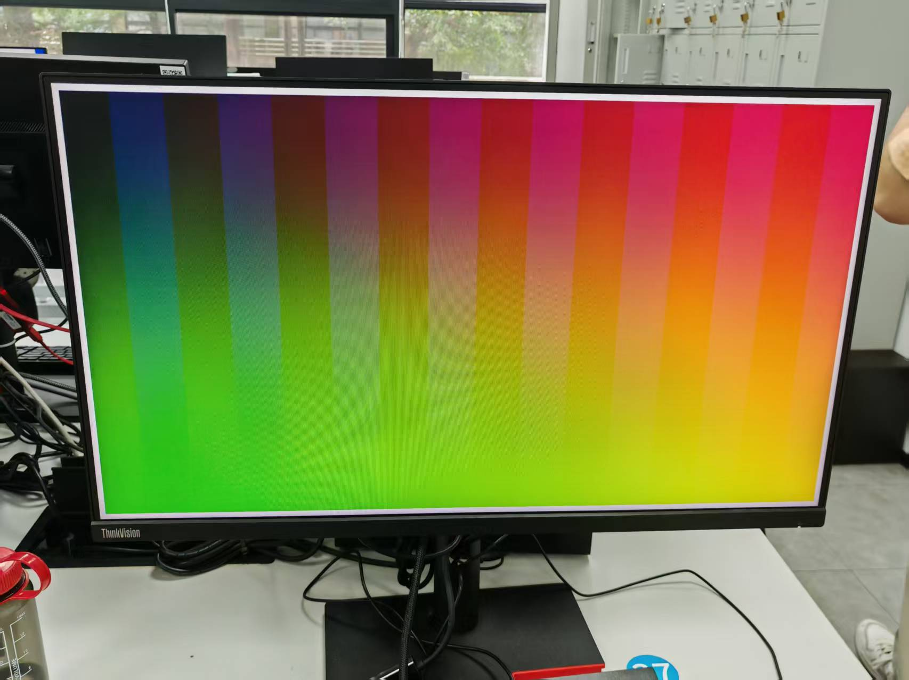


### 4.4.2 上位机串口信息


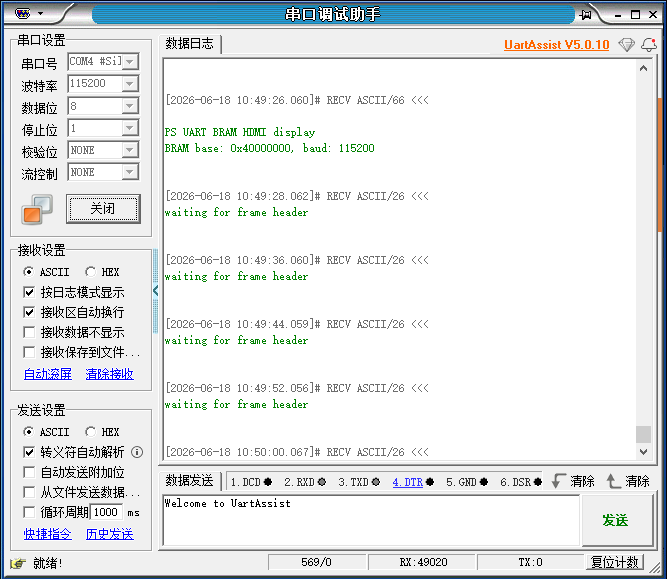


### 4.4.3 资源利用率和时序结果


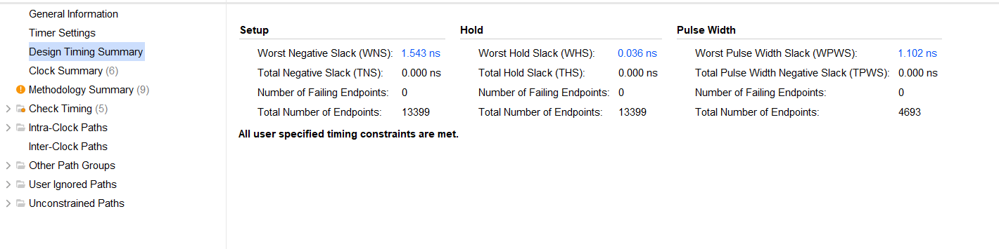


## 4.6 扩展实验

本实验实现扩展为调整图片显示位置；修改HDMI背景颜色；增加图像边框。

- 调整图片显示位置：通过修改image_x和image_y的计算偏移量，可实现图片在屏幕上的位置调整。

- 修改背景颜色：修改非图像区域的RGB默认值，可实现不同背景色。串口图像仍正常显示，背景颜色按设计变化。

- 增加简单边框：在图像区域边缘增加像素判断条件，当坐标位于边界时输出特定颜色，实现边框效果。

最后得到的实验现象如下， 图像往右下偏移并添加了黄色边框，背景颜色改为深蓝色。


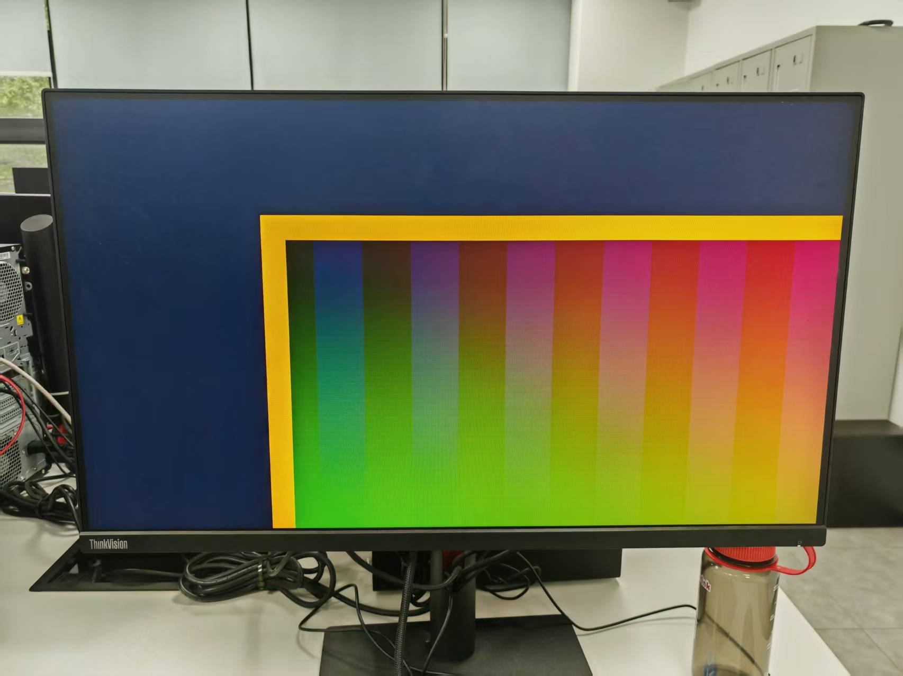

## 4.7 扩展实现关键代码
### 4.7.1 图像偏移

```verilog
// ===== 在参数定义区域添加 =====
// 图片缩放倍数（原始128x72，显示为256x144）
localparam DISPLAY_SCALE = 2;
localparam DISP_WIDTH = IMG_WIDTH * DISPLAY_SCALE;   // 256
localparam DISP_HEIGHT = IMG_HEIGHT * DISPLAY_SCALE; // 144
// 左上角偏移（像素）
localparam H_OFFSET = 50;
localparam V_OFFSET = 50;

// ===== 修改坐标映射逻辑 =====
// 原来：全屏缩放（10倍）
// assign image_x = active_x / SCALE_X;
// assign image_y = active_y / SCALE_Y;
// assign image_word_addr = {image_y, 7'b0} + {7'd0, image_x};

// 修改后：带偏移的缩放映射
wire img_h_active, img_v_active, img_active;
assign img_h_active = (active_x >= H_OFFSET) && (active_x < (H_OFFSET + DISP_WIDTH));
assign img_v_active = (active_y >= V_OFFSET) && (active_y < (V_OFFSET + DISP_HEIGHT));
assign img_active = img_h_active && img_v_active;

assign image_x = (active_x - H_OFFSET) / DISPLAY_SCALE;
assign image_y = (active_y - V_OFFSET) / DISPLAY_SCALE;
assign image_word_addr = {image_y, 7'b0} + {7'd0, image_x};

// ===== 修改 BRAM 使能逻辑 =====
// 原来：全屏有效区使能
// bram_en <= video_active;
// bram_addr_reg <= video_active ? {16'd0, image_word_addr, 2'b00} : 32'd0;

// 修改后：仅在图像显示区域使能
bram_en <= video_active && img_active;
bram_addr_reg <= (video_active && img_active) ? {16'd0, image_word_addr, 2'b00} : 32'd0;
```

### 4.7.2 更换深蓝色背景

```verilog
// ===== 在参数定义区域添加 =====
// 背景颜色（深蓝）
localparam [7:0] BG_R = 8'h0A;
localparam [7:0] BG_G = 8'h1A;
localparam [7:0] BG_B = 8'h3A;

// ===== 修改 RGB 输出逻辑 =====
// 原来：有效区显示图像，消隐区输出黑色
// assign rgb_r = de_reg_d1 ? pixel_reg[23:16] : 8'h00;
// assign rgb_g = de_reg_d1 ? pixel_reg[15:8]  : 8'h00;
// assign rgb_b = de_reg_d1 ? pixel_reg[7:0]   : 8'h00;

// 修改后：有效区显示图像，消隐区显示背景色
assign rgb_r = de_reg_d1 ? pixel_reg[23:16] : BG_R;
assign rgb_g = de_reg_d1 ? pixel_reg[15:8]  : BG_G;
assign rgb_b = de_reg_d1 ? pixel_reg[7:0]   : BG_B;
```

### 4.7.3 添加金色图像边框

```verilog
// ===== 在参数定义区域添加 =====
// 边框宽度（图像像素单位）
localparam BORDER_WIDTH = 4;
// 边框颜色（金色）
localparam [7:0] BORDER_R = 8'hFF;
localparam [7:0] BORDER_G = 8'hD7;
localparam [7:0] BORDER_B = 8'h00;

// ===== 添加边框判断信号 =====
wire is_border;
assign is_border = (image_x < BORDER_WIDTH) || 
                    (image_x >= (IMG_WIDTH - BORDER_WIDTH)) || 
                    (image_y < BORDER_WIDTH) || 
                    (image_y >= (IMG_HEIGHT - BORDER_WIDTH));

// ===== 修改 RGB 输出逻辑（优先级：边框 > 图像内容 > 背景色） =====
// 若同时实现扩展1和扩展2，则：
assign rgb_r = de_reg_d1 ? (
    (img_active && is_border) ? BORDER_R :
    (img_active ? pixel_reg[23:16] : BG_R)
) : 8'h00;
assign rgb_g = de_reg_d1 ? (
    (img_active && is_border) ? BORDER_G :
    (img_active ? pixel_reg[15:8] : BG_G)
) : 8'h00;
assign rgb_b = de_reg_d1 ? (
    (img_active && is_border) ? BORDER_B :
    (img_active ? pixel_reg[7:0] : BG_B)
) : 8'h00;
```

# 五、实验四：sobel_04_uart_sobel_hdmi

## 5.1 实验目标

本实验在sobel_03基础上完成Sobel边缘检测显示。数据由PC端通过串口发送到ZYNQ7020，PS端负责接收128×72 RGB888图像并写入AXI BRAM，PL端从BRAM读取原始图像，完成灰度转换和Sobel运算，最后把边缘检测结果通过HDMI显示。

## 5.2 系统框架和数据流结构说明

### 5.2.1 系统总体架构

本实验系统由 PC 端、ZYNQ PS 端和 ZYNQ PL 端三大部分组成，与 sobel\_03 相比，PL 端增加了灰度转换和 Sobel 边缘检测模块：

- **PC 端**：通过 USB 串口发送图像数据（摄像头采集或图片文件）

- **ZYNQ PS 端**：    

    - UART 外设：接收串口数据

    - 软件程序：解析图像帧协议，将像素数据写入 BRAM

    - AXI GP0 总线：PS 与 PL 之间的数据交互通道

    - AXI BRAM Controller：控制 BRAM 的 AXI 接口

- **ZYNQ PL 端**：    

    - Block RAM：存储一帧原始 RGB 图像（双口 RAM，A 口 PS 写，B 口 PL 读）

    - hdmi\_bram\_sobel\_display：核心模块，包含扫描状态机、灰度转换、Sobel 核心、边缘缓存和 HDMI 显示

    - rgb\_to\_gray：RGB888 转灰度模块

    - sobel\_core：Sobel 边缘检测核心模块

    - edge\_mem：一帧边缘结果缓存

    - video\_clock：视频时钟 IP 核

    - rgb2dvi\_0：DVI 编码 IP 核

- **HDMI 显示器**：显示最终边缘图像

### 5.2.2 数据流说明

整个系统的数据流如下：

1. PC 端通过 USB 串口按协议发送图像帧数据

2. ZYNQ PS 端 UART 外设接收串口字节数据

3. PS 软件程序解析串口数据，将原始 RGB 像素数据通过 AXI 总线写入 BRAM

4. PL 端 hdmi\_bram\_sobel\_display 模块在每帧开始时（video\_frame\_start）启动扫描状态机

5. 扫描状态机按顺序从 BRAM 中读取 128x72 个像素的 RGB 数据

6. RGB 数据送入 rgb\_to\_gray 模块，转换为 8 位灰度值

7. 灰度像素流送入 sobel\_core 模块，进行 3x3 窗口的 Sobel 卷积运算

8. Sobel 输出的边缘强度数据在 edge\_valid 有效时写入 edge\_mem

9. 当一帧图像全部处理完成后（edge\_frame\_done 置高），sobel\_done 信号置位

10. HDMI 显示时序产生，在有效显示区域内从 edge\_mem 中读取边缘数据

11. 边缘数据同时赋值给 R、G、B 三个通道，形成灰度显示

12. RGB 数据与同步信号输入到 rgb2dvi\_0 模块，编码为 TMDS 信号输出到 HDMI 显示器

显示比例关系：输入图像 128 x 72，Sobel 输出 128 x 72 8bit 边缘图，HDMI 输出 1280 x 720，缩放倍数为 10 x 10 倍整数缩放。

###5.2.3 与 sobel\_03 的对比

本实验与 sobel\_03 的主要区别在于 PL 端的处理逻辑：

|对比项|sobel\_03|sobel\_04|
|---|---|---|
|PL 端显示模块|hdmi\_bram\_display|hdmi\_bram\_sobel\_display|
|BRAM 内容|直接显示 RGB 原图|读取原图，Sobel 处理后显示边缘|
|图像处理|无，直接显示|灰度转换 \+ Sobel 边缘检测|
|输出画面|彩色原图|黑白灰度边缘图|
|状态机|无，直接读 BRAM 显示|三状态机（扫描\-等待\-显示）|
|额外存储|无|edge\_mem（一帧边缘缓存）|

## 5.3 关键代码与模块分析

### 5.3.1 顶层模块 \(top\.v\)

顶层模块负责连接 PS 子系统和 PL 端逻辑，与 sobel\_03 基本相同，主要包含两个子模块的实例化：

- **ps\_uart\_bram\_hdmi\_wrapper**：ZYNQ Processing System 封装，包含 PS 处理器、AXI 总线和 BRAM 控制器

- **hdmi\_pl\_top**：PL 端 HDMI 显示顶层，包含视频时钟、Sobel 显示模块和 DVI 编码

两个模块之间通过 BRAM\_PORTB 接口连接，实现 PS 写入、PL 读取的数据交互。

### 5.3.2 PL 端显示顶层 \(hdmi\_pl\_top\.v\)

该模块是 PL 端 HDMI 显示的顶层，与 sobel\_03 相比，主要区别是将显示模块从 hdmi\_bram\_display 替换为 hdmi\_bram\_sobel\_display。

模块内实例化了三个子模块：

- **hdmi\_bram\_sobel\_display**：BRAM 图像读取、Sobel 处理和 HDMI 显示控制（核心模块）

- **video\_clock**：视频时钟 IP 核，产生像素时钟和 5 倍串行时钟

- **rgb2dvi\_0**：DVI 编码 IP 核，将并行 RGB 转换为串行 TMDS 信号

复位同步电路和 BRAM 接口定义与 sobel\_03 相同。

### 5.3.3 核心显示模块 \(hdmi\_bram\_sobel\_display\.v\)

这是本实验最核心的模块，集成了扫描状态机、BRAM 读取、灰度转换、Sobel 处理、边缘缓存和 HDMI 显示等全部功能。

#### 1. 状态定义

```verilog
localparam SCAN_IDLE = 2'd0;  // 空闲状态，等待帧开始
localparam SCAN_RUN  = 2'd1;  // 扫描运行状态，逐像素读 BRAM
localparam SCAN_WAIT = 2'd2;  // 等待状态，等待 Sobel 处理完成
```

与 sobel\_02 的四状态机类似，但本实验使用三状态机，因为显示是持续进行的，不需要单独的 ST\_DISPLAY 状态。

#### 2. 边缘缓存 \(edge\_mem\)

```verilog
(* ram_style = "block" *) reg [7:0] edge_mem [0:9215];
```

edge\_mem 是一个 9216 x 8bit 的块 RAM，用于存储一帧 Sobel 边缘检测结果。容量为 128 x 72 = 9216 个像素，每个像素 8 位边缘强度。

**写入时机**：当 edge\_valid 信号有效时，将 edge\_data 写入 edge\_wr\_addr 对应的地址。

```verilog
always @(posedge clk) begin
    if (edge_valid) begin
        edge_mem[edge_wr_addr] <= edge_data;
    end
end
```

**读取时机**：在 HDMI 显示的有效区域内，根据显示坐标 disp\_addr 读取边缘数据。

```verilog
always @(posedge clk) begin
    ...
    edge_rd_addr <= video_active ? disp_addr : 14'd0;
    edge_pixel <= edge_mem[edge_rd_addr];
    ...
end
```

#### 3. 像素输出映射

Sobel 边缘结果映射为 HDMI 灰度显示的方式是将 8 位边缘强度同时赋值给 R、G、B 三个通道：

```verilog
assign rgb_r = (de_reg_d0 && sobel_done) ? edge_pixel : 8'h00;
assign rgb_g = (de_reg_d0 && sobel_done) ? edge_pixel : 8'h00;
assign rgb_b = (de_reg_d0 && sobel_done) ? edge_pixel : 8'h00;
```

当 sobel\_done 信号有效（即一帧处理完成）且处于有效显示区域时，输出边缘像素值；否则输出黑色。由于 R、G、B 三个通道值相同，因此显示为灰度图像，边缘强度越大，像素越亮。

#### 4. BRAM 扫描逻辑

模块使用扫描状态机逐像素读取 BRAM 中的原始图像：

```verilog
case (scan_state)
    SCAN_IDLE: begin
        if (video_frame_start) begin
            scan_state <= SCAN_RUN;
            scan_x <= 7'd0;
            scan_y <= 7'd0;
            scan_frame_start <= 1'b1;
        end
    end
    SCAN_RUN: begin
        if (scan_last) begin
            scan_state <= SCAN_WAIT;
            scan_x <= 7'd0;
            scan_y <= 7'd0;
        end else if (scan_x == 7'd127) begin
            scan_x <= 7'd0;
            scan_y <= scan_y + 7'd1;
        end else begin
            scan_x <= scan_x + 7'd1;
        end
    end
    SCAN_WAIT: begin
        if (edge_frame_done) begin
            scan_state <= SCAN_IDLE;
            sobel_done <= 1'b1;
        end
    end
    default: begin
        scan_state <= SCAN_IDLE;
    end
endcase
```

关键状态转换说明：

- SCAN\_IDLE → SCAN\_RUN：每帧开始时（video\_frame\_start）自动启动扫描，scan\_frame\_start 脉冲启动 Sobel 模块

- SCAN\_RUN → SCAN\_WAIT：所有像素（128x72）都从 BRAM 读出并送入流水线后，等待处理完成

- SCAN\_WAIT → SCAN\_IDLE：edge\_frame\_done 置高，说明一帧 Sobel 处理全部完成，sobel\_done 置位

与 sobel\_02 不同的是，本实验的扫描是在每帧 HDMI 显示开始时触发的，这样可以确保每帧都处理最新的 BRAM 图像数据。

#### 5. 流水线延迟对齐

由于 BRAM 读取有一个时钟周期的延迟，加上灰度转换和 Sobel 处理的多级流水线延迟，模块使用了两级寄存器打拍来对齐扫描坐标和数据：

```verilog
scan_valid_d1 <= scan_issue;
scan_valid_d2 <= scan_valid_d1;
scan_x_d1 <= scan_x;
scan_y_d1 <= scan_y;
scan_x_d2 <= scan_x_d1;
scan_y_d2 <= scan_y_d1;
```

scan\_valid\_d2 和 scan\_x\_d2/scan\_y\_d2 与 BRAM 读出的数据对齐，作为 rgb\_to\_gray 模块的输入。

#### 6. 图像处理流水线

模块内实例化了完整的图像处理流水线：

```verilog
rgb_to_gray u_rgb_to_gray (
    .clk(clk),
    .rst_n(~rst),
    .rgb_valid(scan_valid_d2),
    .r(bram_dout[23:16]),
    .g(bram_dout[15:8]),
    .b(bram_dout[7:0]),
    .x({9'd0, scan_x_d2}),
    .y({9'd0, scan_y_d2}),
    .gray_valid(gray_valid),
    .gray(gray),
    .gray_x(gray_x),
    .gray_y(gray_y)
);

sobel_core #(
    .WIDTH(IMG_WIDTH),
    .HEIGHT(IMG_HEIGHT)
) u_sobel_core (
    .clk(clk),
    .rst_n(~rst),
    .frame_start(scan_frame_start),
    .gray_valid(gray_valid),
    .gray(gray),
    .gray_x(gray_x),
    .gray_y(gray_y),
    .edge_valid(edge_valid),
    .edge_data(edge_data),
    .edge_x(edge_x),
    .edge_y(edge_y),
    .edge_frame_done(edge_frame_done)
);
```

整个流水线的数据流：

1. BRAM 读出 RGB888 数据（bram\_dout）

2. 送入 rgb\_to\_gray 转换为 8bit 灰度

3. 灰度像素流送入 sobel\_core 进行边缘检测

4. Sobel 输出的边缘数据写入 edge\_mem

#### 7. BRAM 地址生成

```verilog
assign scan_word_addr = {scan_y, 7'b0} + {7'd0, scan_x};
bram_addr_reg <= scan_issue ? {16'd0, scan_word_addr, 2'b00} : 32'd0;
```

scan\_word\_addr 是像素在 BRAM 中的字地址（每个字对应一个像素，32bit）。BRAM 地址为 32 位字节地址，字地址左移 2 位（乘以 4）得到字节地址。

#### 8. BRAM 使能控制

```verilog
bram_en <= scan_issue || scan_valid_d1 || scan_valid_d2;
```

BRAM 使能信号在扫描期间、以及流水线延迟期间都保持有效，确保 BRAM 数据正确读出。

#### 9. \(rgb\_to\_gray\.v\)

与 sobel\_02 中的模块相同，使用整数近似的灰度转换公式：

- 输入：RGB 三通道 8 位数据及 valid 信号

- 输出：8 位灰度值及对应 valid 信号

- 算法：Gray = \(77R \+ 150G \+ 29B\) \>\> 8

- 延迟：1 个时钟周期

对应标准灰度公式 Gray = 0\.299R \+ 0\.587G \+ 0\.114B 的整数近似。

#### 10. 核心模块 \(sobel\_core\.v\)

与 sobel\_02 中的模块相同，实现 3x3 窗口的 Sobel 边缘检测：

- 输入：灰度像素流及坐标信息，frame\_start 帧开始脉冲

- 输出：边缘强度数据、坐标及帧完成信号

- 行缓存：两行缓存实现滑动窗口

- 卷积核：Gx = \[\-1,0,1; \-2,0,2; \-1,0,1\]，Gy = \[\-1,\-2,\-1; 0,0,0; 1,2,1\]

- 梯度幅值：\|Gx\| \+ \|Gy\| 近似

- 边界处理：边界像素输出为 0

- flush 机制：补全最后几行输出，产生 edge\_frame\_done

#### 11. 端软件 \(main\.c\)

PS 端软件与 sobel\_03 基本相同，主要区别在于：

- 启动信息打印不同，标识为 sobel\_04 版本

- 启动信息中增加了图像尺寸的打印

- 每成功接收一帧后打印 "received frame N"

- 核心功能（UART 接收、协议解析、BRAM 写入）保持不变

PS 端只负责接收图像并写入 BRAM，不参与 Sobel 运算，Sobel 处理完全由 PL 端硬件完成。这体现了软硬件协同设计的思想：PS 负责灵活的通信和控制，PL 负责高速并行的图像处理运算。


### 5.4 实验现象与结果分析

### 5.4.1 HDMI显示图像

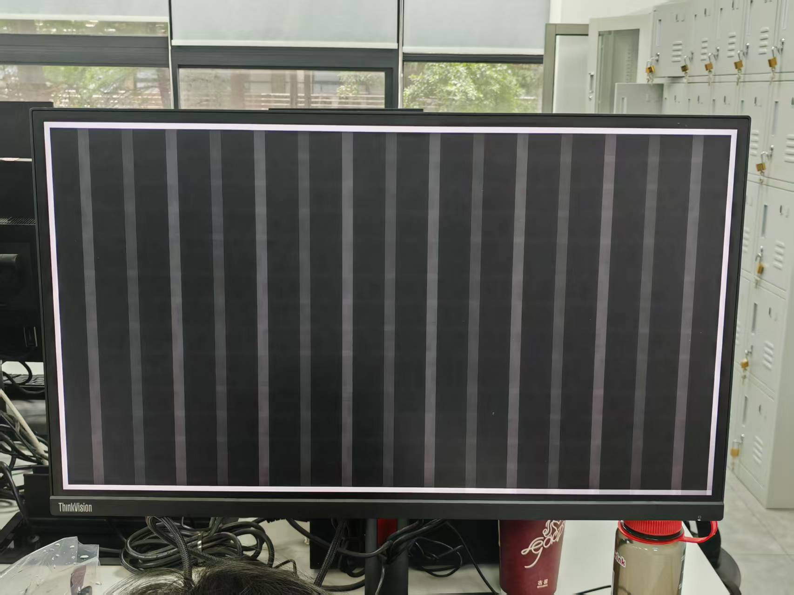

### 5.4.2 资源利用率和时序结果

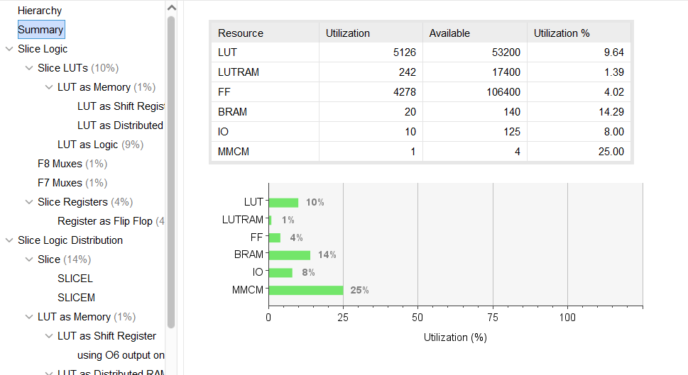


### 5.5 扩展实验结果

5.5.1 固定阈值二值化边缘显示

在Sobel输出到RGB映射前增加阈值判断，实现黑白二值边缘图。

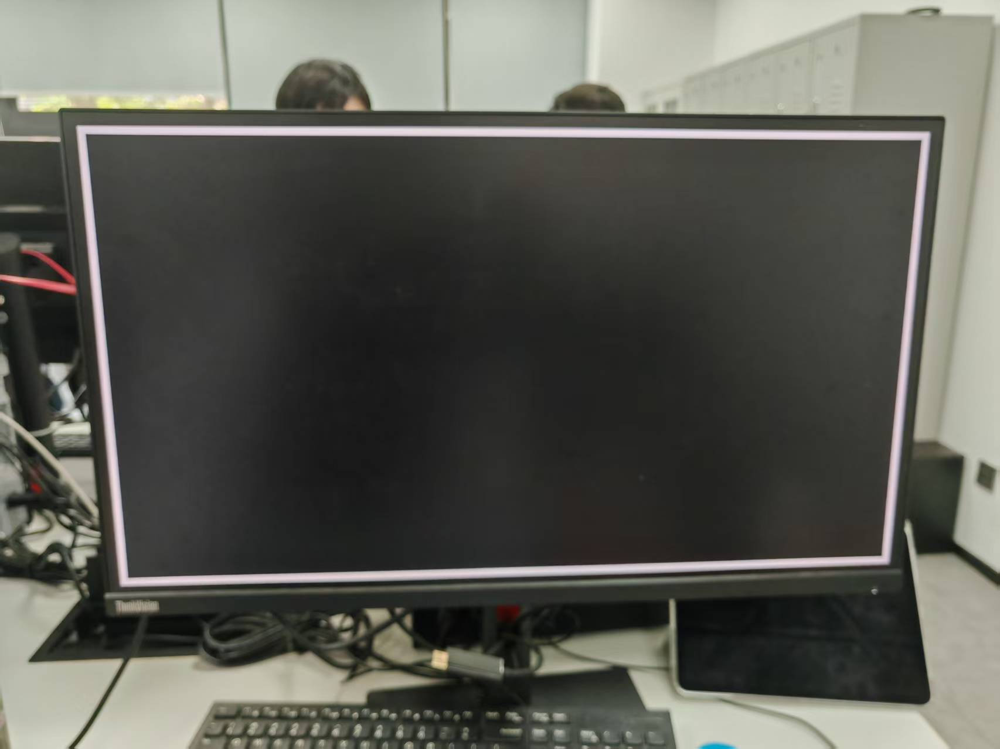


5.5.2 边缘反色显示

将边缘数据取反后输出，原黑底白边变成白底黑边。

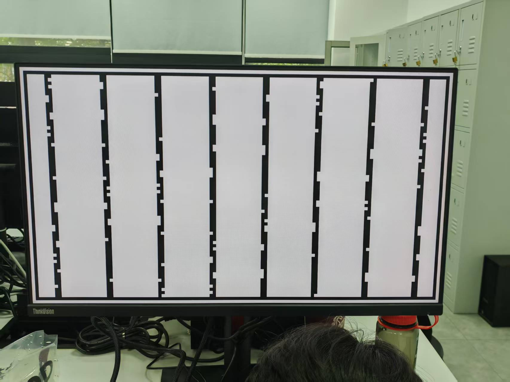


5.5.3彩色边缘标记及Sobel阈值参数对比

对图像边缘像素使用红色突出显示，非边缘区域保持黑色或灰度，增强边缘的视觉辨识度；然后修改二值化阈值，对比不同阈值下边缘检测效果，阈值越低检测到的边缘越多但噪声也越多。

下面所示图片从上往下分别为在为图像添加红色边缘标记之后，且阈值在50，100，40下的HDMI显示效果。

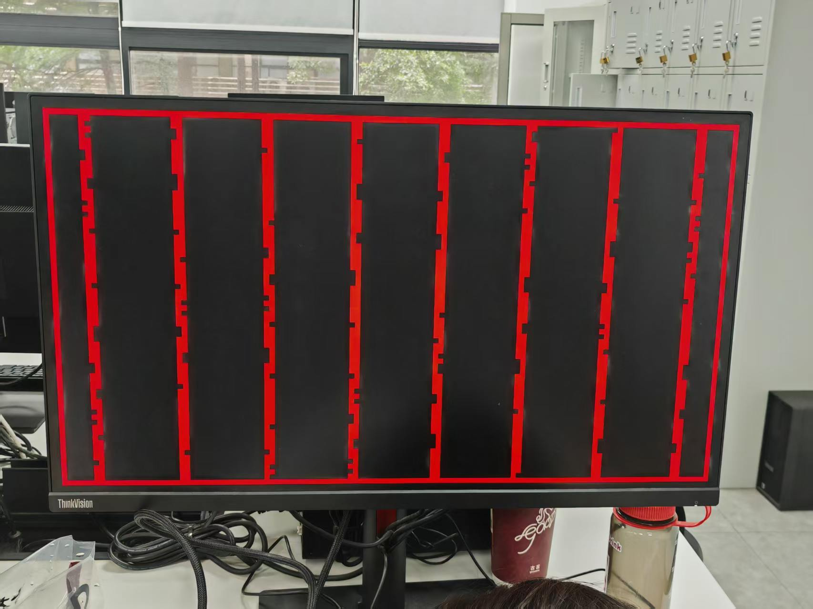

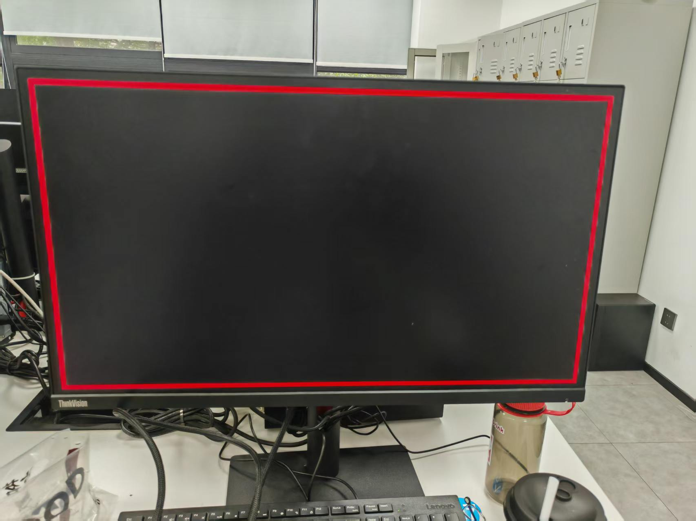

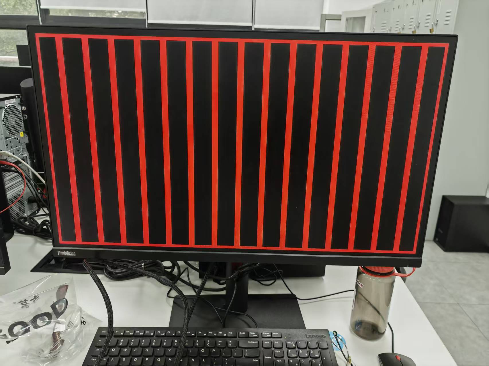

5.5.4彩色边缘标记及Sobel阈值参数对比

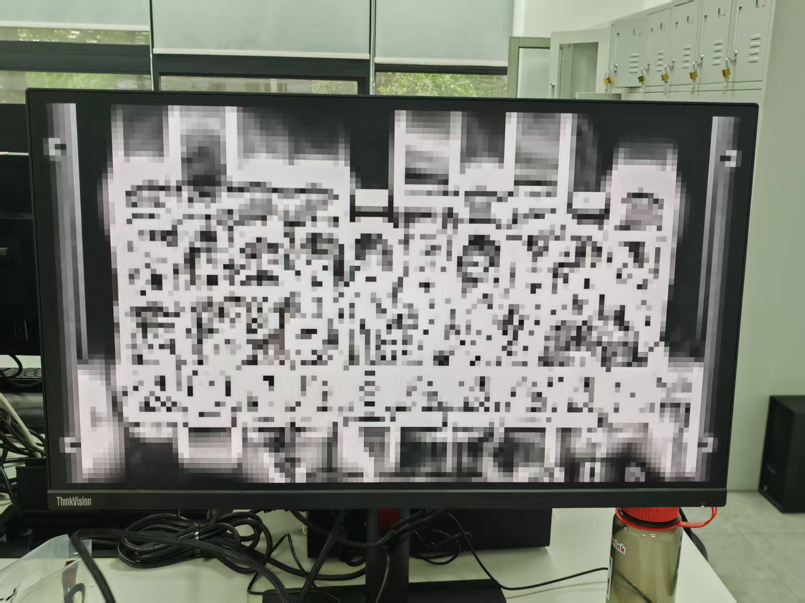

## 6.1扩展实现关键代码

### 修改1：参数配置区域

```verilog
// ========== 扩展参数配置 ==========
// 显示模式选择：0=二值化边缘，1=反色边缘，2=彩色边缘，3=原始灰度
parameter DISPLAY_MODE = 0;  // 修改此值切换模式（0-3）

// Sobel阈值参数（用于二值化）
parameter SOBEL_THRESHOLD = 50;  // 默认阈值50，可调范围0-255

// 彩色边缘标记颜色（RGB各8位）
parameter EDGE_COLOR_R = 8'hFF;  // 红色分量
parameter EDGE_COLOR_G = 8'h00;  // 绿色分量  
parameter EDGE_COLOR_B = 8'h00;  // 蓝色分量 (红色边缘)
```

### 修改2：新增扩展信号定义，新增二值化、反色、彩色标记等中间信号和模式选择输出信号

```verilog
// ========== 扩展信号 ==========
wire [7:0] edge_thresholded;  // 二值化后的边缘
wire [7:0] edge_inverted;     // 反色边缘
wire [7:0] edge_colored;      // 彩色边缘标记
wire de_active;               // 有效显示使能

// 模式选择输出信号
reg [7:0] selected_r;
reg [7:0] selected_g;
reg [7:0] selected_b;
// ============================
```

### 修改3：实现二值化、反色、彩色标记三种处理逻辑

```verilog
// ========== 扩展逻辑 ==========
// 1. 固定阈值二值化
assign edge_thresholded = (edge_pixel >= SOBEL_THRESHOLD) ? 8'hFF : 8'h00;

// 2. 边缘反色
assign edge_inverted = ~edge_thresholded;

// 3. 彩色边缘标记（保留原始边缘幅值用于彩色显示）
assign edge_colored = (edge_pixel >= SOBEL_THRESHOLD) ? edge_pixel : 8'h00;
// ============================
```

### 修改4：新增case语句实现四种显示模式切换，替代原有的简单RGB赋值

```verilog
// ========== 模式选择逻辑 ==========
assign de_active = de_reg_d0 && sobel_done;

always @(*) begin
    // 默认值（黑色背景）
    selected_r = 8'h00;
    selected_g = 8'h00;
    selected_b = 8'h00;
    
    if (de_active) begin
        case (DISPLAY_MODE)
            0: begin  // 二值化模式 - 黑底白边
                selected_r = edge_thresholded;
                selected_g = edge_thresholded;
                selected_b = edge_thresholded;
            end
            
            1: begin  // 反色模式 - 白底黑边
                selected_r = edge_inverted;
                selected_g = edge_inverted;
                selected_b = edge_inverted;
            end
            
            2: begin  // 彩色边缘模式 - 边缘用指定颜色突出显示
                if (edge_colored != 8'h00) begin
                    selected_r = EDGE_COLOR_R;
                    selected_g = EDGE_COLOR_G;
                    selected_b = EDGE_COLOR_B;
                end else begin
                    selected_r = 8'h00;
                    selected_g = 8'h00;
                    selected_b = 8'h00;
                end
            end
            
            default: begin  // 原始灰度模式（模式3）
                selected_r = edge_pixel;
                selected_g = edge_pixel;
                selected_b = edge_pixel;
            end
        endcase
    end
end

// ========== RGB输出 ==========
assign rgb_r = selected_r;
assign rgb_g = selected_g;
assign rgb_b = selected_b;
```

### 修改5：边缘数据存储（修改原always块），新增sobel_done复位逻辑，确保扫描开始时重新计算Sobel

```verilog
// ========== 扫描状态机 ==========
always @(posedge clk) begin
    if (rst) begin
        scan_state <= SCAN_IDLE;
        scan_x <= 7'd0;
        scan_y <= 7'd0;
        bram_addr_reg <= 32'd0;
        bram_en <= 1'b0;
        scan_valid_d1 <= 1'b0;
        scan_valid_d2 <= 1'b0;
        scan_x_d1 <= 7'd0;
        scan_y_d1 <= 7'd0;
        scan_x_d2 <= 7'd0;
        scan_y_d2 <= 7'd0;
        scan_frame_start <= 1'b0;
        sobel_done <= 1'b0;
    end else begin
        scan_frame_start <= 1'b0;

        // BRAM使能信号（流水线延迟匹配）
        bram_en <= scan_issue || scan_valid_d1 || scan_valid_d2;
        bram_addr_reg <= scan_issue ? {16'd0, scan_word_addr, 2'b00} : 32'd0;

        // 扫描数据流水线
        scan_valid_d1 <= scan_issue;
        scan_valid_d2 <= scan_valid_d1;
        scan_x_d1 <= scan_x;
        scan_y_d1 <= scan_y;
        scan_x_d2 <= scan_x_d1;
        scan_y_d2 <= scan_y_d1;

        // 状态机
        case (scan_state)
            SCAN_IDLE: begin
                if (video_frame_start) begin
                    scan_state <= SCAN_RUN;
                    scan_x <= 7'd0;
                    scan_y <= 7'd0;
                    scan_frame_start <= 1'b1;
                    sobel_done <= 1'b0;  // <-- 新增：重置sobel_done
                end
            end

            SCAN_RUN: begin
                if (scan_last) begin
                    scan_state <= SCAN_WAIT;
                    scan_x <= 7'd0;
                    scan_y <= 7'd0;
                end else if (scan_x == 7'd127) begin
                    scan_x <= 7'd0;
                    scan_y <= scan_y + 7'd1;
                end else begin
                    scan_x <= scan_x + 7'd1;
                end
            end

            SCAN_WAIT: begin
                if (edge_frame_done) begin
                    scan_state <= SCAN_IDLE;
                    sobel_done <= 1'b1;
                end
            end

            default: begin
                scan_state <= SCAN_IDLE;
            end
        endcase
    end
end
```

## 六、系统总体框图和数据流说明

### 6.1 总体架构

ZYNQ7020图像处理系统采用PS+PL的异构架构：

PS端：负责UART通信、图像数据接收、BRAM写入控制

PL端：负责图像读取、灰度转换、Sobel边缘检测、HDMI显示输出

AXI BRAM：作为PS与PL之间的数据共享缓冲区

### 6.2 完整数据流

1. 从PC端图像输入到HDMI显示输出的完整数据流：

2. PC端采集摄像头图像或读取图片文件

3. PC端通过USB串口以115200波特率发送图像数据

4. ZYNQ PS端UART接收图像数据

5. PS软件解析帧头和像素数据

6. PS通过AXI GP0接口将图像写入AXI BRAM

7. PL端从BRAM读取原始RGB图像

8. PL端rgb_to_gray模块进行灰度转换

9. PL端sobel_core模块进行Sobel边缘检测

10. 边缘结果存入edge_mem帧缓存

11. HDMI显示模块从edge_mem读取边缘数据

12. RGB2DVI IP核进行TMDS编码

13. HDMI显示器显示最终边缘检测结果

## 七、当前未解决的问题

Sobel边缘检测噪声：当前Sobel算法直接输出边缘强度，未进行阈值处理和噪声抑制，图像中可能存在较多噪声边缘。

图像分辨率受限：当前使用128×72的低分辨率图像，主要受限于串口带宽和BRAM容量。

## 八、第二周综合扩展计划

### 8.1 计划选择的综合扩展题目

计划选择综合扩展任务3：增加图像处理算法，在现有基础上增加新的PL图像处理算法，并通过命令选择显示结果。
### 8.2 具体计划

1. 算法选择：新增Prewitt边缘检测算法，与原Sobel算法形成对比
2. 软件验证：使用Python或MATLAB生成Prewitt算法的参考结果，作为golden model
3. RTL设计：编写Prewitt算法的Verilog实现，包括3×3窗口生成和卷积计算
4. 仿真验证：编写Testbench，对比RTL输出与软件参考结果，确保功能正确
5. 系统集成：将Prewitt模块集成到显示系统中，增加显示模式切换控制
6. 上板验证：综合实现后下载到开发板，验证上板效果
7. 性能分析：对比Sobel和Prewitt的资源利用率、时序和视觉效果

### 8.3 仿真计划

- 输入测试图像：使用与实验05相同的128×72测试图片
- 验证内容：行场同步时序、ROM地址、像素数据正确性
- 关键观察信号：h_cnt、v_cnt、video_active、image_addr、rgb_r/g/b
